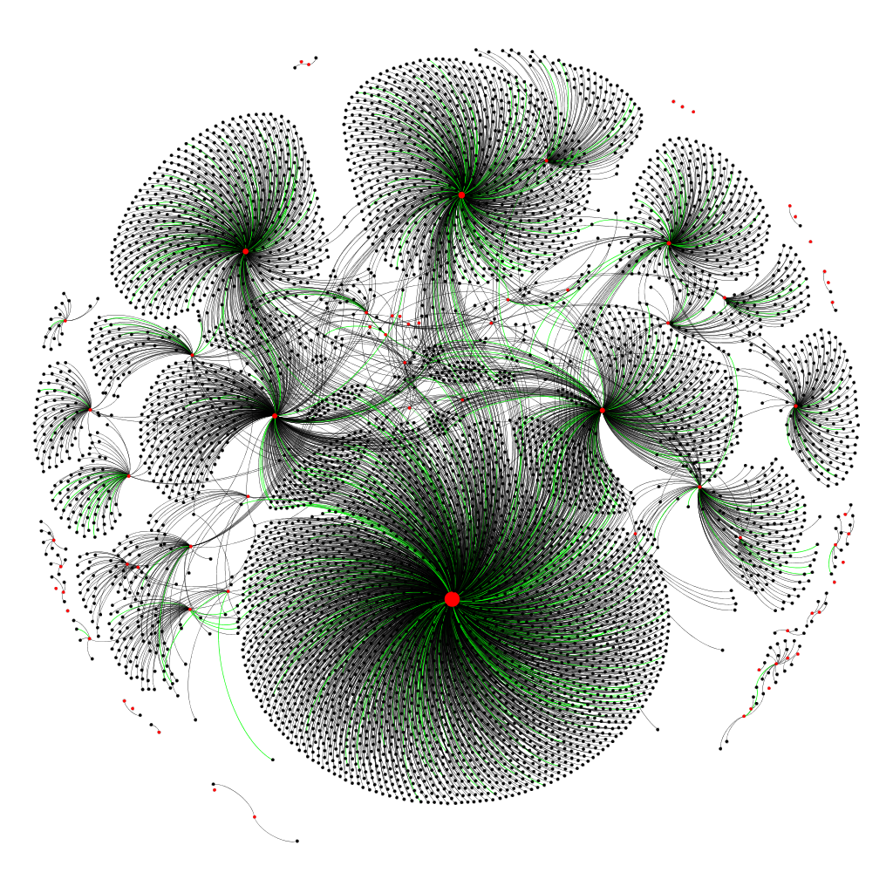

# Retracted Articles Dataset Generator

Retracted Articles Dataset Generator is a script focused on finding COVID-19 retracted articles and those who referenced them.

## Development

Details about the data search accomplished in ***18/04/2021*** and later, in ***25/07/2021***.

### Language

> [Python 3.6](https://www.python.org/downloads/release/python-360/)

### Sources

* [Retraction Watch Database](https://retractionwatch.com/)
* [Semantic Scholar API](https://api.semanticscholar.org/)
* [DOI API](https://www.doi.org/factsheets/DOIProxy.html#rest-api)

### Data from each source

* **Retraction Watch Database**: Title field filtered by “COVID-19” or “coronavirus disease 2019” or “coronavirus 2019” or “SARS- COV-2” or “2019-nCov”. It, then, resulted in 92 articles, from which 9 did not have available DOI, therefore, resulting in 83 from those. Finally, 6 where repeted and had to be excluded, resulting in **77** retracted articles.
* **Semantic Scholar API**: It was used in order to obtain more information about each retracted article and those who referenced them. From those 77 found in the previous step, 4 were not available in this API, consequently, remaining **73** articles.
* **DOI API**: Used to obtain the publication date from the articles.

## First Dataset

* **Format**: GraphML
* **Total Nodes**: 5.884
* **Retracted Nodes**: 73
* **Total Edges**: 6.623
* **Influential Edges**: 423

## Second Dataset

* **Format**: RDF (Turtle)
* **Total Articles**: 9.070
* **Retracted Articles**: 131

### Ontologies used

* [FaBio](https://sparontologies.github.io/fabio/current/fabio.html#d4e5532)
* [CiTo](https://sparontologies.github.io/cito/current/cito.html#d4e1176)

## Repository Files

* [**GRAPHML**](GRAPHML): Containing data from the first data search
    * **dataset_generator.py**: Python script to create dataset
    * **rede-finalv2.gephi**: Gephi project with created graph
    * **rede-finalv2.graphml**: Graph generated by python script
    * **img folder**: Folder with images generated by Gephi using the created graph

* [**RDF**](RDF): Containing data from the second data search
    * **dataset_generator.py**: Python script to create dataset
    * **retracted-2021-07-25.ttl**: Turtle file generated by python script
    * **retracted.json**: Artigos retratados extraídos do Retraction Watch

## License

This project uses the MIT license. For more details, read [LICENSE.md](LICENSE).